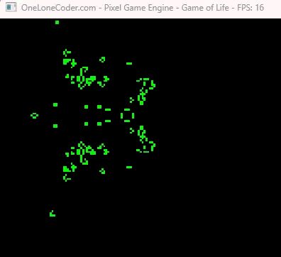
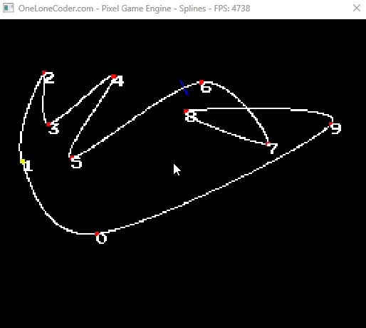

# C++ Projects

## [Game of Life](./src/game-of-life)

This program implements Conway’s Game of Life using the olcPixelGameEngine: it stores the grid as two 1D arrays (state for the current generation and output as a snapshot of the previous generation), initializes state randomly, then on each frame copies state into output, iterates over internal cells, counts the eight Moore neighbors for each cell, and applies the standard Life rules (a live cell survives with 2 or 3 neighbors, a dead cell becomes alive with exactly 3) to compute the next state; the code renders live cells in green and dead cells in black, updates all cells simultaneously via the double-buffer approach, and provides a simple pause control (SPACE) while using 1D indexing (index = y * width + x) for efficient access.

## [Maze Creator](./src/maze-creator)

This program implements the Recursive Backtracking (depth‑first search) algorithm to generate a perfect maze: starting from a random cell it repeatedly chooses a random unvisited neighboring cell, carves a bidirectional path to it, marks it visited and pushes it onto a stack (thereby moving forward). When the current cell has no unvisited neighbors, the algorithm backtracks by popping the stack until it finds a cell with available neighbors, continuing until every cell has been visited. The code represents the grid as a 1D array with bitwise flags for visited state and open walls (N/E/S/W), so carving and testing paths is efficient, and the process is visualized step‑by‑step to show how the maze grows.

## [Maze Creator Random Prim](./src/maze-creator-random-prim/)

This implementation uses the randomized Prim (frontier) method: it begins from a random starting cell, marks it visited and adds its neighbors to a frontier list; then repeatedly picks a random cell from the frontier, connects it to a randomly chosen already-visited neighbor (carving a bidirectional passage), marks that frontier cell visited, adds its unvisited neighbors to the frontier, and removes the processed cell—continuing until the frontier is empty. The result is a perfect maze (no loops, a unique path between any two cells); the code stores the grid as a 1D array with bitwise flags for open walls and visited state, which makes carving, checking neighbors, and visual stepwise rendering efficient.

## [Splines](./src/splines/)

This program implements an interactive Catmull-Rom spline visualizer that allows real-time manipulation of control points to generate smooth interpolating curves; it demonstrates the mathematical foundation of cubic splines by computing both the position and gradient (tangent vector) at any parameter value along the curve, which enables practical applications like camera paths, AI navigation, and smooth animations—the code supports both open and looped spline modes, renders the curve continuously by sampling at fine intervals, and includes an animated agent (marker) that follows the path while a blue line visualizes the instantaneous direction of travel based on the spline's derivative.

## [Television Crazy Pixels](./src/television-crazy-pixels/)

This program generates a TV static effect by continuously iterating through every pixel on the screen (256×240 resolution) each frame and drawing each one with a randomly generated RGB color value; since this happens at high speed (~60 FPS), the result is a flickering, colorful noise pattern that mimics old television snow, demonstrating fundamental concepts like the game loop architecture, direct pixel manipulation, real-time rendering, and random number generation in a graphics context.

