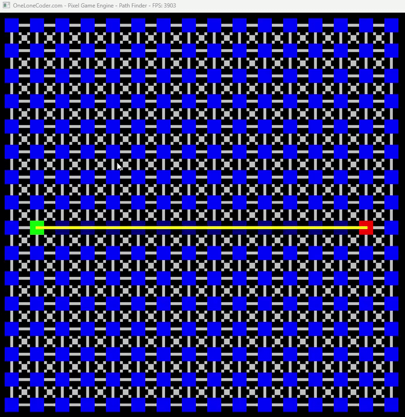

# Path Finder

This program implements the **A* (A-Star)** (https://en.wikipedia.org/wiki/A*_search_algorithm) pathfinding algorithm using the olcPixelGameEngine. It finds the shortest path between two points on a grid while avoiding obstacles in real-time.

## Algorithm: A* (A-Star)

A* is one of the most popular pathfinding algorithms in game development and robotics. It combines the benefits of **Dijkstra's algorithm** (guaranteed optimal path) with heuristic-guided search to achieve superior performance.



### How A* Works

1. **Cost Functions**:
   - `g(n)` = **Local Goal**: actual distance traveled from the start node to node `n`
   - `h(n)` = **Heuristic**: estimated distance from node `n` to the goal (using Euclidean distance in this implementation)
   - `f(n)` = **Global Goal**: `g(n) + h(n)` — total estimated cost through node `n`

2. **Algorithm Steps**:
   - Start at the start node with `g = 0` and `h = heuristic(start, goal)`
   - Maintain a list of "untested" nodes (initially just the start node)
   - While untested nodes exist:
     - Sort untested nodes by their `f(n)` value (global goal)
     - Take the node with the lowest `f(n)` value as the current node
     - Mark it as visited
     - For each unvisited neighbor:
       - Calculate a potentially better path: `tentative_g = current.g + distance(current, neighbor)`
       - If this is better than the neighbor's current `g`, update it and set the current node as its parent
       - Add the neighbor to the untested list if not already there
   - Once the goal node is visited or no more nodes to test, trace the path backward from goal to start using parent pointers

### Why A* is Optimal

- **Completeness**: Always finds a solution if one exists
- **Optimality**: Guarantees the shortest path when using an admissible heuristic (never overestimates)
- **Efficiency**: The heuristic guides the search, reducing the number of nodes explored compared to Dijkstra's algorithm
- **Flexibility**: Works with uniform cost grids, weighted edges, and different heuristics

### Implementation Details

This implementation uses:
- A **2D grid of nodes** (16×16 default) where each node can connect to its 8 neighbors (4-directional + 4 diagonals)
- **Euclidean distance** as the heuristic function
- A **vector-based priority queue** (sorted on each iteration)
- **Parent pointer tracking** to reconstruct the path

## Interactive Features

- **Left Click**: Toggle obstacle on/off
- **Shift + Left Click**: Set the start node (green)
- **Ctrl + Left Click**: Set the end node (red)
- The algorithm re-solves automatically after each change

## Visualization

- **Green**: Start node
- **Red**: Goal node
- **Dark Blue**: Visited nodes (explored by the algorithm)
- **Blue**: Unvisited nodes
- **White**: Obstacles
- **Yellow**: Final optimal path
- **Grey**: Node connections

## Compilation

```bash
g++ -o main.exe main.cpp -luser32 -lgdi32 -lopengl32 -lgdiplus -lShlwapi -ldwmapi -static -std=c++17
```

## Future Pathfinding Algorithms to Implement

### 1. **Dijkstra's Algorithm**
   - Explores all directions equally; simpler than A* but no heuristic
   - Best for: Uniform cost graphs, computing distances to all nodes
   - Difference: Uses only `g(n)`, no heuristic guidance

### 2. **Breadth-First Search (BFS)**
   - Explores nodes level-by-level; guaranteed shortest path on unweighted grids
   - Best for: Simple grid searches, minimal memory usage
   - Difference: No cost awareness; treats all moves as equal

### 3. **Depth-First Search (DFS)**
   - Explores as far as possible along each branch before backtracking
   - Best for: Maze solving, exploring all connected areas
   - Difference: Not optimal for pathfinding; uses stack instead of priority queue

### 4. **Greedy Best-First Search**
   - Purely heuristic-driven; faster than A* but not guaranteed optimal
   - Best for: Real-time applications where approximate paths are acceptable
   - Difference: Uses only `h(n)`, ignoring actual cost `g(n)`

### 5. **Bidirectional Search**
   - Searches from both start and goal simultaneously, meeting in the middle
   - Best for: Reducing search space in large grids
   - Difference: Two frontiers converging; roughly halves search area

### 6. **Jump Point Search (JPS)**
   - Optimized A* variant that "jumps" over symmetrical paths
   - Best for: Uniform-cost grids (like this one); 10x faster than A*
   - Difference: Preprocesses neighbors, skips forced neighbors

### 7. **Theta*** (Theta-Star)
   - Allows pathfinding to cut corners diagonally; produces smoother paths
   - Best for: Continuous environments, games requiring smooth curves
   - Difference: Considers line-of-sight when updating neighbors

### 8. **D*** (D-Star) and D* Lite**
   - Incremental replanning; reuses previous results when obstacles change
   - Best for: Dynamic environments where obstacles move/change frequently
   - Difference: Only recomputes affected nodes instead of full recalculation

### 9. **Rapidly-exploring Random Trees (RRT)**
   - Probabilistic algorithm that explores space via random sampling
   - Best for: High-dimensional spaces, non-grid environments (robotics)
   - Difference: Stochastic; no guarantee of optimality but works in continuous space

### 10. **A* with Different Heuristics**
   - Manhattan distance, Chebyshev distance, or custom domain-specific heuristics
   - Best for: Tuning performance based on grid type or movement rules
   - Difference: Trade-off between accuracy and computation speed
