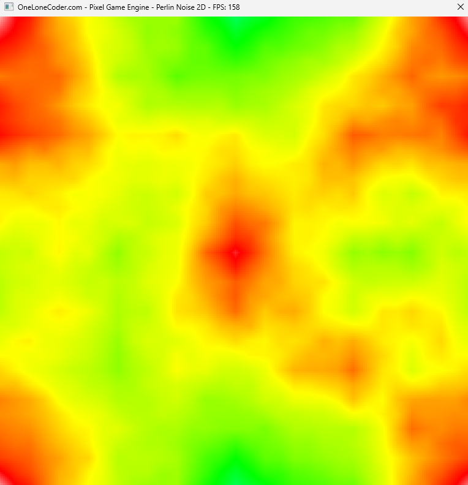
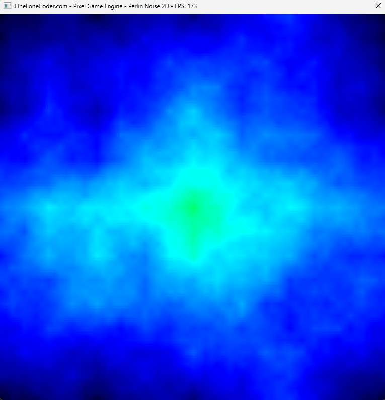
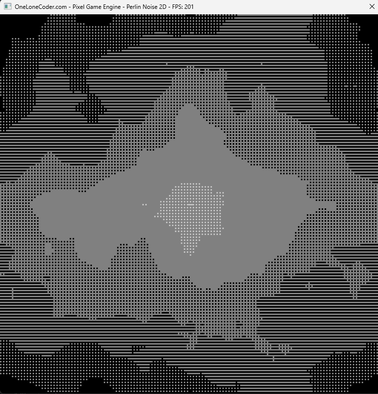

# Perlin Noise 2D

Este projeto demonstra ruído Perlin em 2D usando `olcPixelGameEngine`. Ruído Perlin é uma forma de gerar padrões pseudoaleatórios suaves: os valores ainda nascem de uma semente aleatória, mas são interpolados para evitar mudanças bruscas entre pixels vizinhos. Em 2D, isso é especialmente útil para criar mapas de altura, nuvens, fogo, fumaça, ilhas, texturas naturais e outros efeitos procedurais.

## Como funciona

O programa cria um array `noiseSeed2D` com valores aleatórios para cada posição da tela e usa `PerlinNoise2D()` para transformar essa semente em uma imagem suavizada. Para cada pixel `(x, y)`, o algoritmo calcula amostras em uma grade maior definida pelo `pitch`, mistura os valores no eixo X, depois mistura o resultado no eixo Y. Esse processo é repetido por várias oitavas, acumulando detalhes em diferentes escalas. O valor final é normalizado e salvo em `perlinNoise2D`.

Na renderização, o valor do ruído pode ser exibido em dois modos. O modo padrão usa um heat map, passando de azul escuro para azul, ciano, verde, amarelo, vermelho e branco conforme o valor aumenta. O modo preto e branco usa faixas de brilho com dithering 2x2 para simular tons intermediários entre preto, cinza escuro, cinza e branco.

## Controles

- `SPACE`: aumenta a quantidade de oitavas; depois de `8`, volta para `1`
- `S`: gera uma nova semente aleatória
- `UP`: aumenta o `scalingBias`
- `DOWN`: diminui o `scalingBias`
- `C`: alterna entre heat map colorido e modo preto e branco com dithering

## Build

Compile com:

```bash
g++ -o main.exe main.cpp -luser32 -lgdi32 -lopengl32 -lgdiplus -lShlwapi -ldwmapi -lstdc++fs -static -std=c++17
```

## Run

```powershell
.\main.exe
```

## Notes

- Usa uma resolução interna de `256x256`
- O heat map ajuda a visualizar a intensidade do ruído como se fosse um mapa de altura ou temperatura
- `LerpPixel()` cria transições suaves entre as cores do heat map
- `scalingBias` controla como as oitavas mais detalhadas influenciam o resultado final






